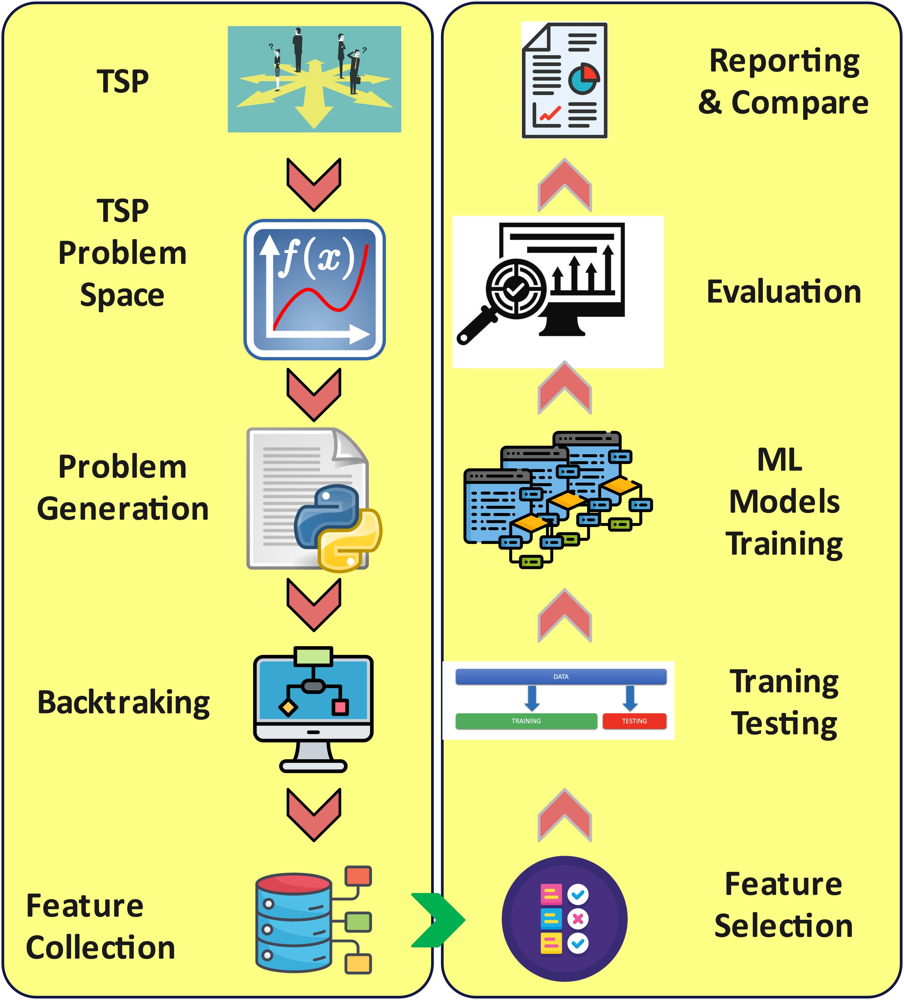

# 🧠 From Recursion to Prediction

This project presents a novel approach to predicting the computational effort of solving the **Traveling Salesman Problem (TSP)** using **backtracking algorithms**, through **machine learning techniques**. 

Instead of brute-force execution, our framework accurately estimates runtime **before** the algorithm is run — saving both time and compute resources. 🕒⚙️

This can support:
- 🚀 Intelligent solver selection  
- 📈 Runtime estimation  
- 🧠 Resource-aware scheduling  

Our experiments demonstrate that regression-based ML models achieve **99% prediction accuracy** for estimating computational workload in TSP backtracking solvers.
## 📊 Results Visualization

